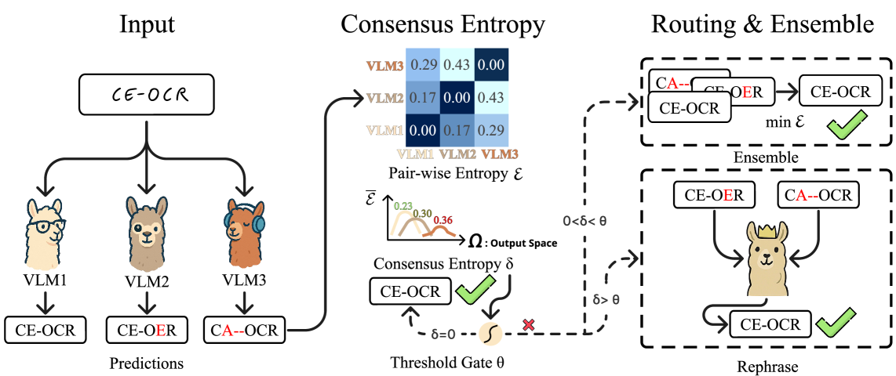
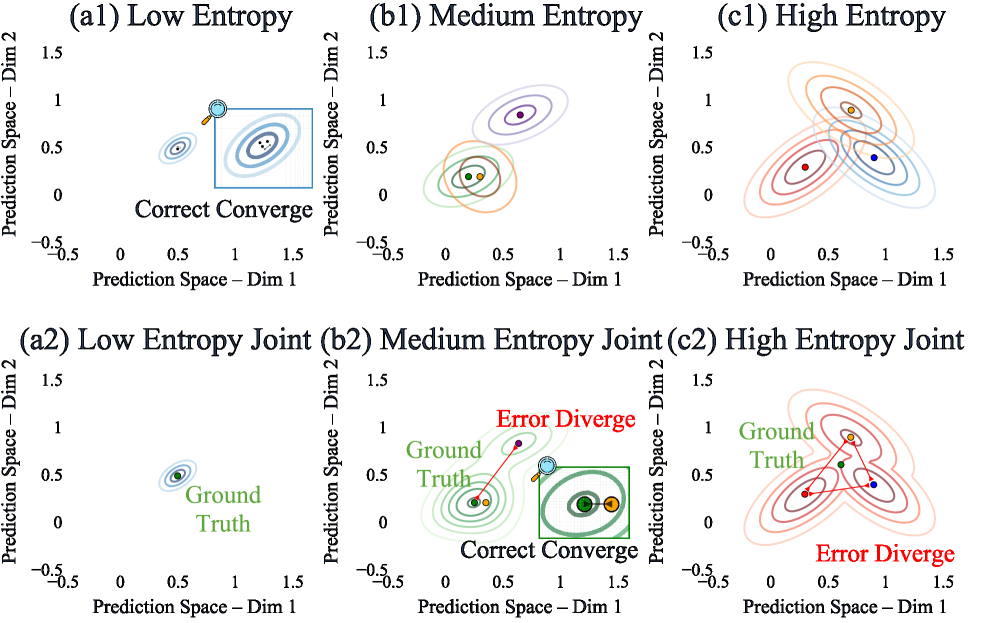
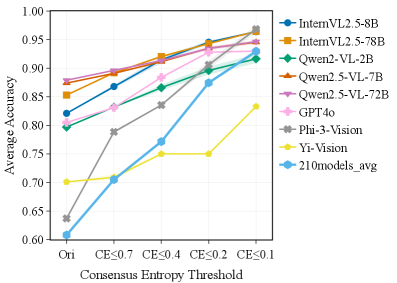

<div align="center">

# Consensus Entropy

### Harnessing Multi-VLM Agreement for Self-Verifying and Self-Improving OCR

Yulong Zhang<sup>1,2,3,*,†</sup>, Tianyi Liang<sup>2,4,*</sup>, Xinyue Huang<sup>5</sup>, Erfei Cui<sup>2,3</sup>, Guoqing Wang<sup>4</sup>, Xu Guo<sup>1,2</sup>, Chenhui Li<sup>4</sup>, Gongshen Liu<sup>3,†</sup>

<sup>1</sup>Fudan University · <sup>2</sup>Shanghai Innovation Institute · <sup>3</sup>Shanghai Jiao Tong University · <sup>4</sup>East China Normal University · <sup>5</sup>Sun Yat-sen University

<sup>*</sup>Equal contribution · <sup>†</sup>Corresponding authors

[](https://cvpr.thecvf.com/Conferences/2026)
[](https://arxiv.org/abs/2504.11101)
[](https://tianyilt.github.io/consensus-entropy/)
[](https://huggingface.co/datasets/Aslan-mingye/OCR-Quality)
[](https://pypi.org/project/consensus-entropy/)
[](LICENSE)

[**Project Page**](https://tianyilt.github.io/consensus-entropy/) |
[**Paper**](https://arxiv.org/abs/2504.11101) |
[**Dataset**](https://huggingface.co/datasets/Aslan-mingye/OCR-Quality) |
[**PyPI**](https://pypi.org/project/consensus-entropy/) |
[**Code Demo**](Code_Demo_CE_Ensemble_and_Filtering/) |
[**Citation**](#citation)

</div>

Official implementation of **Consensus Entropy: Harnessing Multi-VLM Agreement for Self-Verifying and Self-Improving OCR**, accepted by **CVPR 2026**.

Consensus Entropy is a lightweight, model-agnostic signal for measuring agreement among multiple OCR predictions. Given several candidate strings from different vision-language models, OCR engines, or decoding runs, it assigns each candidate a consensus-entropy score based on normalized string disagreement. Lower scores indicate stronger agreement with the candidate set and can be used for OCR verification, result selection, filtering, and multi-model ensembling.

<p align="center">
  
</p>

## News

- **2026-05** — Our paper **Consensus Entropy: Harnessing Multi-VLM Agreement for Self-Verifying and Self-Improving OCR** has been accepted to **CVPR 2026**. 🎉
- **2026-05** — Project page and supplementary code demo released.
- **2025-04** — Paper released on arXiv: [arXiv:2504.11101](https://arxiv.org/abs/2504.11101).

## Highlights

- **Self-verifying OCR signal**: estimate which OCR result is most consistent with a group of candidates.
- **Model-agnostic**: works with outputs from any OCR system or vision-language model.
- **Training-free and lightweight**: no extra labels or model training required; implemented as a compact Python package.
- **Filtering and ensembling**: supports CE-based answer filtering and multi-model OCR ensembling in the released demo.
- **Human-labeled evaluation data**: public OCR quality dataset available on [Hugging Face](https://huggingface.co/datasets/Aslan-mingye/OCR-Quality).
- **Simple API**: compute per-candidate scores or directly retrieve the best OCR result.

<p align="center">
  
  
</p>

## Installation

Install from PyPI:

```bash
pip install consensus-entropy
```

Or install from source:

```bash
git clone https://github.com/Aslan-yulong/consensus-entropy.git
cd consensus-entropy
pip install -e .
```

## Quick Start

### Compute consensus entropy scores

```python
from consensus_entropy import calculate_consensus_entropy

ocr_results = [
    "Hello World",
    "Hello Wrld",
    "Hallo World",
]

scores = calculate_consensus_entropy(ocr_results, task_type="ocr")
print([f"{score:.4f}" for score in scores])
# ['0.0909', '0.1364', '0.1364']
```

Each score measures the average normalized edit distance between one candidate and all other candidates. The lower the value, the closer the candidate is to the group consensus.

### Select the best OCR result

```python
from consensus_entropy import get_best_ocr_result

ocr_results = ["Test1", "Test2", "Text2"]
best_result, best_score = get_best_ocr_result(ocr_results, task_type="ocr")

print(best_result)              # Test2
print(f"{best_score:.4f}")      # 0.2000
```

### Measure pairwise OCR difference

```python
from consensus_entropy import calculate_ocr_difference

score = calculate_ocr_difference("Hello World", "Hello Wrld")
print(f"{score:.4f}")
# 0.0909
```

## API Reference

### `calculate_ocr_difference(a, b)`

Computes the normalized Levenshtein distance between two strings.

- **Input**: two string-like values.
- **Output**: a float in `[0, 1]` for most practical OCR cases, where `0.0` means exact match.

### `calculate_consensus_entropy(strings, task_type="ocr")`

Computes a consensus-entropy score for each candidate string.

- **Input**: a list of at least two strings.
- **Output**: a list of floats with the same length as the input.
- **Current task type**: `"ocr"`.

### `get_best_ocr_result(strings, task_type="ocr")`

Returns the candidate with the lowest consensus-entropy score.

- **Input**: a list of at least two strings.
- **Output**: `(best_result, best_score)`.

## Supplementary Demo

The supplementary material includes a compact OCRBench demo for CE filtering and CE-based multi-model ensembling. It consumes VLMEvalKit-style OCRBench Excel outputs and produces JSON/XLSX analysis files.

```bash
cd Code_Demo_CE_Ensemble_and_Filtering
pip install pandas Levenshtein numpy openpyxl

# CE threshold analysis
python cal_avg_scores_CE_thresholds.py   ./samples/InternVL2_5-8B_OCRBench.xlsx   ./samples/Qwen2-VL-7B-Instruct_OCRBench.xlsx   -o ./res_avg_scores_CE/test.json

# CE-based multi-model ensemble
python ensemble_consensus_entropy_from_xlsx.py   ./samples/InternVL2_5-8B_OCRBench.xlsx   ./samples/Qwen2-VL-7B-Instruct_OCRBench.xlsx   ./samples/Qwen2.5-VL-7B_OCRBench.xlsx   -o ./res_ensemble/
```

## Dataset

We release the human-labeled OCR quality dataset used to validate whether Consensus Entropy aligns with human quality judgments.

[](https://huggingface.co/datasets/Aslan-mingye/OCR-Quality)

- **Hugging Face**: https://huggingface.co/datasets/Aslan-mingye/OCR-Quality
- **Purpose**: evaluate OCR correctness, calibration, and agreement-based verification against human quality labels.
- **Use case**: benchmarking CE-style confidence signals and OCR/VLM result selection methods.

## When to Use Consensus Entropy

Consensus Entropy is useful when you have multiple OCR hypotheses for the same image or document region, for example:

- outputs from several VLMs/OCR engines;
- multiple prompts or decoding settings for the same model;
- repeated OCR runs under different preprocessing pipelines;
- self-verification pipelines where external labels are unavailable.

It is especially helpful as a lightweight ranking or filtering signal before downstream correction, human review, or pseudo-label selection.

## Requirements

- Python >= 3.7
- `numpy`
- `python-Levenshtein`

## Limitations

- The current public package focuses on OCR-style string agreement.
- Consensus Entropy is an agreement signal, not a proof of correctness: several systems can agree on the same wrong answer.
- For best results, use diverse OCR/VLM candidates rather than near-duplicate outputs from the same configuration.

## Citation

If you find this project useful, please cite our paper:

```bibtex
@misc{zhang2025consensusentropyharnessingmultivlm,
      title={Consensus Entropy: Harnessing Multi-VLM Agreement for Self-Verifying and Self-Improving OCR},
      author={Yulong Zhang and Tianyi Liang and Xinyue Huang and Erfei Cui and Guoqing Wang and Xu Guo and Chenhui Li and Gongshen Liu},
      year={2025},
      eprint={2504.11101},
      archivePrefix={arXiv},
      primaryClass={cs.CV},
      url={https://arxiv.org/abs/2504.11101}
}
```

The camera-ready CVPR 2026 citation will be updated once the official proceedings entry is available.

## License

This project is released under the [MIT License](LICENSE).

## Acknowledgements

This repository accompanies the paper **Consensus Entropy: Harnessing Multi-VLM Agreement for Self-Verifying and Self-Improving OCR**. We thank the research community for open OCR and vision-language model resources that make reproducible OCR verification research possible.
